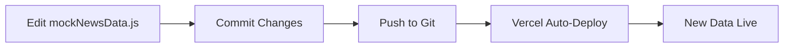

# 🔄 Mock Data Update Guide for Deployment

## 🎯 Problem Solved

**Before**: Mock data was hardcoded in the service file, requiring a full rebuild and redeployment to update news content.

**After**: Mock data is now in a separate, easily editable file that can be updated without rebuilding the entire application.

## 📁 New File Structure

```
frontend/src/data/
├── mockNewsData.js    ← Your news data goes here
├── README.md          ← Detailed documentation
└── MOCK_DATA_UPDATE_GUIDE.md ← This guide
```

## 🚀 How to Update News Data

### **Option 1: Quick Update (Recommended)**

1. **Edit the Data File**

   ```bash
   # Navigate to the data directory
   cd frontend/src/data

   # Edit the mock data file
   code mockNewsData.js  # or use your preferred editor
   ```

2. **Add New News Items**

   ```javascript
   // Add this to the featuredNews array
   {
     id: 13, // Use next available ID
     imageUrl: 'https://images.unsplash.com/photo-1571019613454-1cb2f99b2d8b?w=800&h=400&fit=crop',
     title: "নতুন খবরের শিরোনাম",
     subtitle: "উপশিরোনাম",
     excerpt: "খবরের সংক্ষিপ্ত বিবরণ...",
     publishDate: '2025-01-16T10:00:00Z',
     category: 'নতুন ক্যাটাগরি',
     author: 'রিপোর্টারের নাম',
     readTime: 5
   }
   ```

3. **Commit and Push**

   ```bash
   git add .
   git commit -m "Update mock news data with latest stories"
   git push
   ```

4. **Vercel Auto-Deploy**
   - Vercel will automatically detect the changes
   - Builds and deploys with new data
   - No manual intervention needed

### **Option 2: Bulk Update**

1. **Replace Entire News Array**

   ```javascript
   featuredNews: [
     // Your complete new news array
     // All old news will be replaced
   ];
   ```

2. **Update Trending News**
   ```javascript
   trendingNews: [
     // Your complete new trending news array
   ];
   ```

## 📊 Data Structure Reference

### **Required Fields**

```javascript
{
  id: 1,                    // Unique number
  imageUrl: "URL",          // Image link
  title: "শিরোনাম",        // Main headline
  subtitle: "উপশিরোনাম",   // Sub-headline
  excerpt: "বিবরণ",        // Brief description
  publishDate: "ISO_DATE",  // YYYY-MM-DDTHH:mm:ssZ
  category: "ক্যাটাগরি",   // News category
  author: "রিপোর্টার",     // Author name
  readTime: 5               // Minutes to read
}
```

### **Optional Fields**

```javascript
{
  // Add any other fields you need
}
```

## 🔧 Helper Functions Available

```javascript
import {
  getCurrentDate,
  addNewsItem,
  updateNewsItem,
  deleteNewsItem,
} from "./mockNewsData.js";

// Get current timestamp
const now = getCurrentDate();

// Add new news
addNewsItem({
  id: 14,
  title: "নতুন খবর",
  // ... other fields
});

// Update existing news
updateNewsItem(1, { title: "আপডেটেড শিরোনাম" });

// Delete news
deleteNewsItem(1);
```

## 📅 Date Management

### **Use Current Date**

```javascript
import { getCurrentDate } from "./mockNewsData.js";

{
  publishDate: getCurrentDate();
}
```

### **Manual Date Format**

```javascript
{
  publishDate: "2025-01-16T10:30:00Z";
  // Format: YYYY-MM-DDTHH:mm:ssZ
}
```

## 🎨 Image Management

### **Recommended Image Sources**

- **Unsplash**: `https://images.unsplash.com/photo-ID?w=800&h=400&fit=crop`
- **Your CDN**: `https://your-cdn.com/images/news/image.jpg`
- **External URLs**: Ensure they're accessible and stable

### **Image Requirements**

- **Aspect Ratio**: 16:9 or 4:3 recommended
- **Size**: 800x400px minimum
- **Format**: JPG, PNG, WebP
- **Loading**: Images are lazy-loaded for performance

## 🚨 Important Notes

### **Before Deployment**

1. ✅ **Unique IDs**: No duplicate IDs allowed
2. ✅ **Valid URLs**: All image URLs must be accessible
3. ✅ **Bengali Text**: Use proper Bengali characters
4. ✅ **Data Structure**: Follow the exact format

### **After Deployment**

1. ✅ **Test Images**: Ensure all images load correctly
2. ✅ **Check Content**: Verify Bengali text displays properly
3. ✅ **Mobile View**: Test on mobile devices
4. ✅ **Performance**: Monitor loading times

## 🔄 Update Workflow



## 📱 Testing Your Updates

### **Local Testing**

```bash
cd frontend
npm run dev
# Check your changes in the browser
```

### **Production Testing**

1. Deploy to Vercel
2. Visit your live site
3. Verify new content appears
4. Check both featured and trending sections

## 🆘 Troubleshooting

### **Common Issues**

1. **Images Not Loading**

   - Check image URLs are accessible
   - Verify HTTPS vs HTTP
   - Test URLs in browser

2. **Bengali Text Issues**

   - Ensure proper Bengali font support
   - Check for encoding issues
   - Verify text in browser console

3. **Build Failures**
   - Check for syntax errors in mockNewsData.js
   - Verify all required fields are present
   - Check for missing commas or brackets

### **Get Help**

- Check the `README.md` in the data directory
- Review the console for error messages
- Verify the data structure matches the examples

## 🎉 Success Checklist

- [ ] Mock data file updated
- [ ] All required fields filled
- [ ] Unique IDs assigned
- [ ] Valid image URLs
- [ ] Proper Bengali text
- [ ] Changes committed and pushed
- [ ] Vercel deployment successful
- [ ] New content visible on live site
- [ ] Both featured and trending sections updated

## 🚀 Ready to Update!

Your application is now set up for easy mock data updates. Simply edit the `mockNewsData.js` file, commit your changes, and Vercel will automatically deploy the updates. No more rebuilding required!

**Next Step**: Edit `frontend/src/data/mockNewsData.js` with your latest news content!
